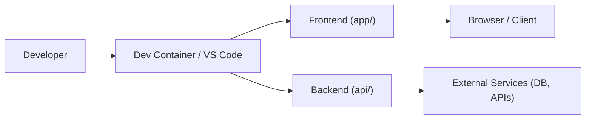

# 🧰 Devbox Template

このリポジトリは、VS Code の Dev Container を前提にした開発用テンプレートです。ルート README は高レベルな概要、リポジトリ構成、技術スタック、構成図を提供し、言語固有の詳細手順は各サブディレクトリの `README.md` に委譲します。

## 📄 Abstract

- フロントエンド (Vite + React + TypeScript) とバックエンド (Python API) を想定したワークスペースの雛形
- Dev Container と VS Code タスクを使った再現性の高い開発フローの提供

## 📁 Directory Structure

- 本プロジェクトのディレクトリ構成は以下の通りです。
- 各ディレクトリ以下の詳細な説明は、各ディレクトリ以下の`README.md`を参照してください。

```bash
.
├── .claude/                      # Claude Code 関連の設定
│   ├── .gitignore                  # Claude Code 向けのGit除外定義
│   ├── settings.json               # Claude Code の設定
│   ├── settings.local.json         # Claude Code のローカル設定
│   └── statusline.py               # ステータスライン表示のスクリプト
├── .devcontainer/                # Dev Container 関連の設定
│   ├── devcontainer.json           # Dev Container の主要設定
│   ├── devcontainer.env            # Dev Container 内で使う環境変数
│   ├── postCreate.sh               # コンテナ作成後に実行されるスクリプト
│   ├── postStart.sh                # コンテナ起動後に実行されるスクリプト
│   └── features/                   # 自作の Dev Container Feature
├── .github/                      # GitHub 関連の設定
│   ├── pull_request_template.md    # GitHub Pull Request のテンプレート
│   ├── ISSUE_TEMPLATE              # GitHub Issue のテンプレート
│   │   ├── feature_request.md        # GitHub Issue の機能要望テンプレート
│   │   └── bug_report.md             # GitHub Issue のバグ報告テンプレート
│   ├── instructions/               # GitHub Copilot のシステムプロンプト
│   └── workflows/                  # GitHub Actions
├── .vscode/                      # VSCode 関連の設定
│   ├── extensions.json             # 推奨拡張機能
│   ├── launch.json                 # デバッグ構成
│   ├── mcp.json                    # GitHub Copilot の MCP 設定
│   ├── settings.json               # VSCode の設定
│   └── tasks.json                  # ビルド構成
├── .gitignore                    # Git 除外定義
├── .mcp.json                     # Claude Code の MCP servers の設定
├── api/                          # バックエンド例
├── app/                          # フロントエンド例
├── biome.jsonc                   # Biome (コード整形・静的解析)の設定
├── changelog.config.js           # Git コミットテンプレート
├── CLAUDE.md                     # Claude Code のシステムプロンプト
├── LICENSE                       # ライセンス
└── README.md                     # README
```


## 🧩 Stack

以下は、本プロジェクトの主要な技術とその説明です。

| Category | Technology | Description |
|---|---|---|
| Editor | VS Code | 開発環境 |
| Container | Dev Containers | 開発コンテナ |
| Container | Docker | コンテナ実行基盤 |
| Container | Ubuntu 24.04 (Noble) | ベースイメージ |
| Shell | Zsh | デフォルトシェル  |
| Shell | Oh My Zsh | シェルカスタム |
| VCS | Git | バージョン管理システム |
| Cloud | AWS CLI | AWS コマンドラインツール |
| Cloud | Azure CLI | Azure コマンドラインツール |
| IaC | Terraform | インフラストラクチャ as コード |
| Agents | Anthropic　Claude Code | AI コーディングエージェント |
| Agents | OpenAI　Codex | AI コーディングアシスタント |
| Agents | GitHub Copilot | AI コーディングアシスタント |
| Agents | Cline | AI コーディングアシスタント |
| Quality | pre-commit | Git フック管理 |
| Quality | git-cz | コミットメッセージ支援 |
| Utility | vim | テキストエディタ |
| Utility | jq | JSON プロセッサ |

> [!NOTE]
> フロントエンドとバックエンドの詳細な技術スタックは、各サブディレクトリの [`app/README.md`](app/README.md) と [`api/README.md`](api/README.md) を参照してください。

### MCP Servers

| Technology | Type | Description |
|---|---|---|
| sequential-thinking | Reasoning | 段階的な思考プロセスを提供 |
| github | VCS | GitHub リポジトリ操作 |
| gitlab | VCS | GitLab リポジトリ操作 |
| serena-app | Coding | シンボリック解析によるコード支援 (app) |
| serena-api | Coding | シンボリック解析によるコード支援 (api) |
| gitingest-mcp | Search | リポジトリインデックス化と検索 |
| deepwiki | Docs | 外部ドキュメント検索 |
| context7 | Docs | ライブラリドキュメント参照 |
| awslabs.aws-documentation-mcp-server | Docs | AWS 公式ドキュメント |
| microsoft.docs.mcp | Docs | Microsoft Learn ドキュメント |
| cloudflare-documentation-mcp-server | Docs | Cloudflare ドキュメント |

## 🗺️ Architecture Diagram



## 🚀 Getting Started

> [!NOTE]
> このプロジェクトは Windows + WSL2 環境での開発を前提としています。

### Setup

初めて開発環境をセットアップする場合は、以下の手順に従ってください。

#### 1. Windows 側のツールインストール

> [!IMPORTANT]
> PowerShell を**管理者権限**で開いて実行してください。

```powershell
# PowerShell (管理者権限)

# AWS CLI のインストール
winget install -e --id Amazon.AWSCLI

# Azure CLI のインストール
winget install -e --id Microsoft.AzureCLI

# Git のインストール
winget install -e --id Git.Git

# PowerShell のインストール (最新版)
winget install -e --id Microsoft.PowerShell

# VS Code のインストール
winget install -e --id Microsoft.VisualStudioCode
```

#### 2. WSL2 のセットアップ

```powershell
# PowerShell (管理者権限)

# WSL2 のインストール (Ubuntu がデフォルトでインストールされます)
wsl --install
```

> [!WARNING]
> インストール後、**Windows を再起動**してください。

再起動後、Ubuntu が自動的に起動するので、ユーザー名とパスワードを設定してください。

#### 3. WSL 内での初期設定

```bash
# WSL (Ubuntu)

# passwordless sudo の設定
sudo visudo
```

エディタ (nano) が開いたら、**最後に**以下の行を追加してください[^1]：

```bash
%sudo ALL=(ALL) NOPASSWD:ALL
```

[^1]: nano エディタの操作: `Ctrl+X` で終了、`Y` で保存確認、`Enter` で確定

### 4. AWS CLI と Azure CLI の認証情報共有

```bash
# WSL (Ubuntu)

# Windows の .aws ディレクトリへシンボリックリンクを作成
ln -s /mnt/c/Users/<YOUR_WINDOWS_USERNAME>/.aws ~/.aws

# Windows の .azure ディレクトリへシンボリックリンクを作成
ln -s /mnt/c/Users/<YOUR_WINDOWS_USERNAME>/.azure ~/.azure
```

> [!IMPORTANT]
> `<YOUR_WINDOWS_USERNAME>` は実際の Windows ユーザー名に置き換えてください。

### 5. Docker のインストール

> [!NOTE]
> 公式手順: https://docs.docker.com/engine/install/ubuntu/

#### 5.1. Docker の apt リポジトリをセットアップ

```bash
# WSL (Ubuntu)

# Docker の公式 GPG キーを追加
sudo apt-get update
sudo apt-get install ca-certificates curl
sudo install -m 0755 -d /etc/apt/keyrings
sudo curl -fsSL https://download.docker.com/linux/ubuntu/gpg -o /etc/apt/keyrings/docker.asc
sudo chmod a+r /etc/apt/keyrings/docker.asc

# リポジトリを Apt ソースに追加
echo \
  "deb [arch=$(dpkg --print-architecture) signed-by=/etc/apt/keyrings/docker.asc] https://download.docker.com/linux/ubuntu \
  $(. /etc/os-release && echo "${UBUNTU_CODENAME:-$VERSION_CODENAME}") stable" | \
  sudo tee /etc/apt/sources.list.d/docker.list > /dev/null
sudo apt-get update
```

#### 5.2. Docker パッケージをインストール

```bash
# WSL (Ubuntu)

# Docker Engine, CLI, containerd, プラグインをインストール
sudo apt-get install docker-ce docker-ce-cli containerd.io docker-buildx-plugin docker-compose-plugin
```

#### 5.3. Docker グループにユーザーを追加

```bash
# WSL (Ubuntu)

# 自分のユーザーを docker グループに追加
sudo usermod -aG docker $USER

# グループの変更を反映
newgrp docker
```

> [!TIP]
> `newgrp docker` を実行する代わりに、ログアウト/再ログインでもグループ変更が反映されます。

#### 5.4. Docker の動作確認

```bash
# WSL (Ubuntu)

# Docker の動作確認
docker run hello-world
```

### 6. VS Code の設定

#### 6.1. Dev Containers 拡張機能のインストール

1. VS Code を開く
2. Extensions (`Ctrl+Shift+X`) を開く
3. "Dev Containers" で検索
4. Install をクリック

#### 6.2. Dev Containers の WSL 設定を有効化

1. 設定を開く (`Ctrl+,`)
2. "dev containers execute in wsl" で検索
3. **Dev > Containers: Execute In WSL** にチェックを入れる

#### 7. リポジトリのクローン

```bash
# WSL (Ubuntu)

# repos ディレクトリを作成
mkdir -p ~/repos
cd ~/repos

# リポジトリをクローン
git clone <YOUR_REPOSITORY_URL>
cd devbox
```

> [!IMPORTANT]
> `<YOUR_REPOSITORY_URL>` は実際のリポジトリ URL に置き換えてください。

> [!TIP]
> Windows のエクスプローラーから WSL 内のファイルにアクセスしやすくするために、`\\wsl$\Ubuntu\home\<YOUR_USERNAME>\repos` へのショートカットを作成することをおすすめします。
>
> または、エクスプローラーのアドレスバーに `\\wsl$\Ubuntu\home\<YOUR_USERNAME>\repos` を入力して、フォルダを右クリック → "ショートカットの作成" を選択してください。

### Quick Start (通常時)

既に環境構築が完了している場合は、以下の手順で開発を開始できます。

#### 1. WSL を起動

```powershell
# PowerShell

# WSL (Ubuntu) を起動
wsl
```

> [!NOTE]
> WSL が既に起動している場合は、この手順をスキップして次に進んでください。

#### 2. プロジェクトディレクトリに移動

```bash
# WSL (Ubuntu)

# devbox ディレクトリに移動
cd ~/repos/devbox
```

#### 3. VS Code で Dev Container を起動

```bash
# WSL (Ubuntu)

# VS Code で開く
code .
```

VS Code が開いたら：
1. 右下に「**Reopen in Container**」の通知が表示されるのでクリック
2. または、`Ctrl+Shift+P` → "**Dev Containers: Reopen in Container**" を選択

> [!TIP]
> コンテナが既に起動している場合は、通知が表示されません。

#### 4. アプリケーションを起動

アプリケーションの起動方法は、各サブディレクトリの README を参照してください：
- フロントエンド: [`app/README.md`](app/README.md)
- バックエンド: [`api/README.md`](api/README.md)

## 🛠️ Conventions & Notes

- 言語固有の具体的なコマンドや環境変数の設定は `api/README.md` と `app/README.md` に記載しています
- 秘密情報や API キーは環境変数で管理し、リポジトリにハードコードしないでください

## 🔜 Future Work

- CI/CD の追加（テスト・lint の自動化）
- Mermaid 図の詳細化
- プロジェクトテンプレート化のための CLI スクリプト整備

## 📜 License

Copyright (c) 2020-2025 [k5-mot](https://github.com/k5-mot/) All Rights Reserved.

[k5-mot/devbox](https://github.com/k5-mot/devbox/) is under [MIT license](https://en.wikipedia.org/wiki/MIT_License).
