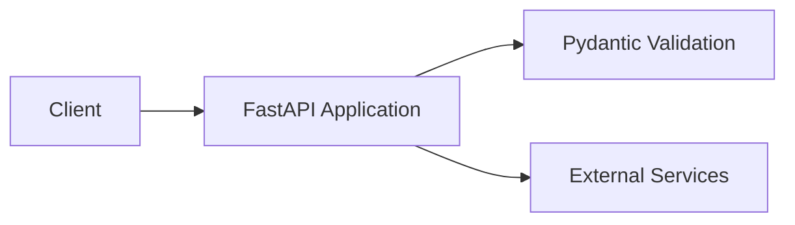

# 🐍 Backend API

このディレクトリは Python ベースのバックエンド API を格納しています。

## 📝 Requirements

- Python 3.12 以上 (pyproject.toml の `requires-python` に準拠)
- Dev Container 環境での実行を推奨
- 仮想環境での実行を推奨（ローカル開発時）

## 🗺️ Architecture Diagram



## 🧩 Stack

| Category | Technology | Description |
|---|---|---|
| Language | Python 3.12 | プログラミング言語 |
| Package | uv | パッケージマネージャ (推奨) |
| Package | pip | パッケージマネージャ (代替) |
| Framework | FastAPI | Web API フレームワーク |
| Server | uvicorn | ASGI サーバ |
| Validation | Pydantic | データバリデーション |
| Linter | Ruff | コード整形・静的解析 |
| Quality | pre-commit | Git フック管理 |

## 📁 Directory Structure

```
api/
├── .serena/           # Serena MCP サーバ設定
├── .venv/             # 仮想環境 (ローカル開発時)
├── .gitignore         # Git 除外定義
├── .python-version    # Python バージョン指定
├── main.py            # アプリケーションエントリポイント
├── pyproject.toml     # プロジェクト設定と依存関係
├── uv.lock            # uv ロックファイル
└── README.md          # このファイル
```

## 🚀 Getting Started

### Setup (初回のみ)

Dev Container を使用する場合は、この手順をスキップしてください。
ローカル環境で開発する場合のみ、以下の手順を実行してください。

#### 仮想環境の作成と有効化

```bash
# api ディレクトリに移動
cd api

# 仮想環境を作成
python -m venv .venv

# 仮想環境を有効化
source .venv/bin/activate  # Linux/macOS
# または
.venv\Scripts\activate     # Windows
```

#### 依存関係のインストール

uv を使用する場合（推奨）:

```bash
# uv で依存関係をインストール
uv sync

# または開発依存を含める場合
uv sync --all-extras
```

pip を使用する場合:

```bash
# pip で依存関係をインストール
pip install -e .

# または開発依存を含める場合
pip install -e .[dev]
```

### Quick Start (通常時)

Dev Container 内で以下のいずれかの方法でバックエンドを起動できます。

#### 方法1: VS Code タスクを使用（推奨）

1. `Ctrl+Shift+P` でコマンドパレットを開く
2. "Tasks: Run Task" を選択
3. "Start Both Servers" を選択（フロントエンド・バックエンド両方起動）
4. または "Start Backend" を選択（バックエンドのみ起動）

#### 方法2: 手動でコマンド実行

```bash
# Dev Container 内のターミナルで実行
cd api
uvicorn main:app --reload --port 8000
```

API ドキュメントは http://localhost:8000/docs にアクセスしてください（FastAPI の自動生成ドキュメント）。

### Step-by-Step Start (詳細手順)

#### 1. 依存関係のインストール確認

```bash
cd api

# uv の場合
uv sync

# pip の場合
pip install -e .[dev]
```

#### 2. 開発サーバの起動

```bash
# uvicorn で開発サーバを起動
uvicorn main:app --reload --port 8000
```

オプション:
- `--reload`: ファイル変更時に自動リロード
- `--port 8000`: ポート番号を指定（デフォルト: 8000）
- `--host 0.0.0.0`: すべてのネットワークインターフェースで待ち受け

#### 3. API の動作確認

ブラウザまたは curl で以下にアクセス:

- **API ドキュメント**: http://localhost:8000/docs
- **ReDoc ドキュメント**: http://localhost:8000/redoc
- **OpenAPI スキーマ**: http://localhost:8000/openapi.json

curl を使用した例:

```bash
# ヘルスチェック（エンドポイントが実装されている場合）
curl http://localhost:8000/health

# または任意のエンドポイント
curl http://localhost:8000/
```

## 🛠️ Contributing

コード品質を維持するため、以下のツールを使用してコードチェックを行ってください。

### Lint (コード静的解析)

```bash
cd api

# Ruff で lint チェック
ruff check .

# 自動修正可能な問題を修正
ruff check --fix .
```

### Format (コード整形)

```bash
cd api

# Ruff でコード整形
ruff format .

# 整形のチェックのみ（変更しない）
ruff format --check .
```

### Type Check (型チェック)

```bash
cd api

# pyright で型チェック
pyright

# または mypy を使用する場合
mypy .
```

### Test (テスト実行)

```bash
cd api

# pytest でテスト実行
pytest

# カバレッジ付きでテスト実行
pytest --cov=. --cov-report=html

# 特定のテストファイルのみ実行
pytest tests/test_main.py

# verbose モードで実行
pytest -v
```

### 一括チェック

```bash
cd api

# すべてのチェックを一度に実行
ruff check . && ruff format --check . && pyright && pytest
```

### pre-commit フック

pre-commit を使用すると、コミット前に自動的にコード品質チェックを実行できます:

```bash
# pre-commit のインストール
pip install pre-commit

# Git フックをインストール
pre-commit install

# 手動で全ファイルに対して実行
pre-commit run --all-files
```

## 📝 Notes

- 環境変数やシークレットは `.env` ファイルで管理し、リポジトリにハードコードしないでください
- API エンドポイントの詳細は FastAPI の自動生成ドキュメント (http://localhost:8000/docs) を参照してください
- 本番環境では `--reload` オプションを外して実行してください
