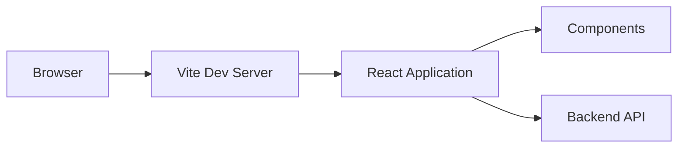

# ⚛️ Frontend Application

このディレクトリは React + TypeScript + Vite ベースのフロントエンドアプリケーションを格納しています。

## 📝 Requirements

- Node.js 22.16.0 以上
- pnpm（推奨）、npm、または yarn
- Dev Container 環境での実行を推奨

## 🗺️ Architecture Diagram



## 🧩 Stack

| Category | Technology | Description |
|---|---|---|
| Language | TypeScript | プログラミング言語 |
| Runtime | Node.js 22.16.0 | JavaScript ランタイム |
| Package | pnpm | パッケージマネージャ (推奨) |
| Package | npm | パッケージマネージャ (代替) |
| Package | yarn | パッケージマネージャ (代替) |
| Build | Vite | フロントエンドビルドツール |
| Framework | React | UI ライブラリ |
| Linter | Biome | コード整形・静的解析 |

## 📁 Directory Structure

```
app/
├── .serena/              # Serena MCP サーバ設定
├── node_modules/         # 依存パッケージ
├── public/               # 静的アセット
├── src/                  # アプリケーションソース
│   ├── App.tsx             # メインアプリケーションコンポーネント
│   ├── main.tsx            # エントリーポイント
│   └── ...                 # その他のコンポーネント
├── .env                  # 環境変数
├── .gitignore            # Git 除外定義
├── index.html            # HTML エントリーポイント
├── package.json          # プロジェクト設定と依存関係
├── pnpm-lock.yaml        # pnpm ロックファイル
├── pnpm-workspace.yaml   # pnpm ワークスペース設定
├── tsconfig.json         # TypeScript 設定（ベース）
├── tsconfig.app.json     # TypeScript 設定（アプリケーション用）
├── tsconfig.node.json    # TypeScript 設定（Node.js 用）
├── vite.config.ts        # Vite 設定
└── README.md             # このファイル
```

## 🚀 Getting Started

### Setup (初回のみ)

Dev Container を使用する場合は、この手順をスキップしてください。
ローカル環境で開発する場合のみ、以下の手順を実行してください。

#### 依存関係のインストール

pnpm を使用する場合（推奨）:

```bash
# app ディレクトリに移動
cd app

# pnpm で依存関係をインストール
pnpm install
```

npm を使用する場合:

```bash
# app ディレクトリに移動
cd app

# npm で依存関係をインストール
npm install
```

yarn を使用する場合:

```bash
# app ディレクトリに移動
cd app

# yarn で依存関係をインストール
yarn install
```

### Quick Start (通常時)

Dev Container 内で以下のいずれかの方法でフロントエンドを起動できます。

#### 方法1: VS Code タスクを使用（推奨）

1. `Ctrl+Shift+P` でコマンドパレットを開く
2. "Tasks: Run Task" を選択
3. "Start Both Servers" を選択（フロントエンド・バックエンド両方起動）
4. または "Start Frontend" を選択（フロントエンドのみ起動）

#### 方法2: 手動でコマンド実行

```bash
# Dev Container 内のターミナルで実行
cd app
pnpm run dev
# または
npm run dev
```

ブラウザで http://localhost:5173 にアクセスしてください。

### Step-by-Step Start (詳細手順)

#### 1. 依存関係のインストール確認

```bash
cd app

# pnpm の場合
pnpm install

# npm の場合
npm install

# yarn の場合
yarn install
```

#### 2. 開発サーバの起動

```bash
# pnpm の場合
pnpm run dev

# npm の場合
npm run dev

# yarn の場合
yarn dev
```

開発サーバが起動すると、以下のような出力が表示されます:

```
  VITE v5.x.x  ready in xxx ms

  ➜  Local:   http://localhost:5173/
  ➜  Network: http://xxx.xxx.xxx.xxx:5173/
  ➜  press h + enter to show help
```

#### 3. アプリケーションの動作確認

ブラウザで http://localhost:5173 にアクセスしてください。

Vite の HMR (Hot Module Replacement) により、ソースコードの変更が自動的にブラウザに反映されます。

#### 4. ビルドとプレビュー（本番環境確認）

```bash
cd app

# ビルド
pnpm run build  # または npm run build

# プレビュー（本番ビルドの動作確認）
pnpm run preview  # または npm run preview
```

プレビューサーバは http://localhost:4173 で起動します。

## 🛠️ Contributing

コード品質を維持するため、以下のツールを使用してコードチェックを行ってください。

### Lint (コード静的解析)

```bash
cd app

# Biome で lint チェック
pnpm run lint
# または
npm run lint

# 自動修正可能な問題を修正
pnpm run lint:fix
# または
npm run lint:fix
```

### Format (コード整形)

```bash
cd app

# Biome でコード整形
pnpm run format
# または
npm run format

# 整形のチェックのみ（変更しない）
pnpm run format:check
# または
npm run format:check
```

### Type Check (型チェック)

```bash
cd app

# TypeScript で型チェック
pnpm run type-check
# または
npm run type-check

# または tsc を直接実行
tsc --noEmit
```

### Check (包括的なチェック)

```bash
cd app

# Biome で lint + format + type check を一度に実行
pnpm run check
# または
npm run check
```

### 一括チェック

```bash
cd app

# すべてのチェックを一度に実行
pnpm run lint && pnpm run format:check && pnpm run type-check
# または
npm run lint && npm run format:check && npm run type-check
```

### Test (テスト実行)

> [!NOTE]
> このテンプレートにはテストフレームワークが含まれていません。
> 必要に応じて Vitest や Jest を導入してください。

Vitest を導入する場合:

```bash
cd app

# Vitest のインストール
pnpm add -D vitest @vitest/ui
# または
npm install -D vitest @vitest/ui

# package.json に以下を追加
# "scripts": {
#   "test": "vitest",
#   "test:ui": "vitest --ui"
# }

# テスト実行
pnpm run test
# または
npm run test
```

## 📝 Notes

- 環境変数は `.env` ファイルで管理し、リポジトリにシークレットをハードコードしないでください
- Vite の環境変数は `VITE_` プレフィックスが必要です（例: `VITE_API_URL`）
- パッケージマネージャは `pnpm` を推奨していますが、`npm` や `yarn` でも動作します
- Node.js のバージョンは 22.16.0 を使用しています
- HMR が動作しない場合は、ブラウザのキャッシュをクリアしてください
